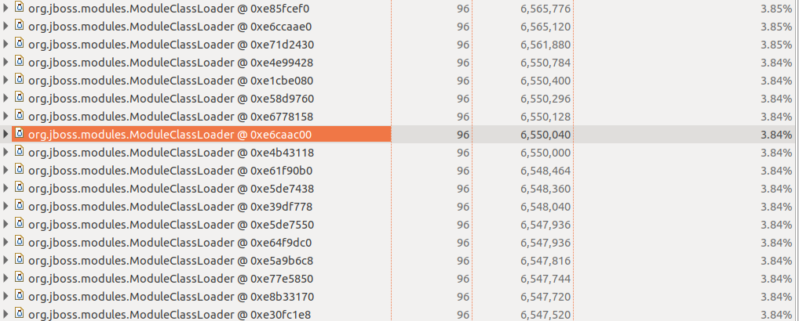
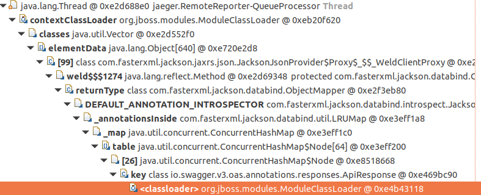

# swagger-core memory leak poc

This repository contains a very basic Java 11 / JEE 8 web application. This application is used as a proof of concept to 
demonstrate that there's a memory leak when using the [swagger-core](https://github.com/swagger-api/swagger-core/) library.

This bug happens when using the swagger-jaxrs2 module.

# Why

I have been experiencing very strange memory leak in my web application. These memory leaks happens especially
when redeploying my applications on Wildfly without restarting it from time to time.

I have already spent some time on this issue, and finally managed to identify the memory leak. It was due to the ClassGraph
library that swagger-jaxrs2 use. The issue was reported to ClassGraph [here](https://github.com/classgraph/classgraph/issues/376)
and the fix has been released in version 4.8.51. An issue has been opened in swagger-core [here](https://github.com/swagger-api/swagger-core/pull/3449)
to update ClassGraph version, and has been merged (but not released yet).

I have clone the swagger-core repository, build the new version (with the merged fixes), deploy my web application with the new swagger version,
and the memory leak is still there. But it's not ClassGraph fault this time.

# How to reproduce the memory leak

Here's the following procedure to reproduce the memory leak.

I'm using Java 11 (OpenJDK) & Wildfly 16 for my test.

## Install Wildfly

Just head out to the [Wildfly download page](https://wildfly.org/downloads/), and download a version (version does not matters).

- Extract the version somewhere in your hard drive.

- Create a administration user using the script located in bin/add-user.sh

- Start the application server using bin/standalone.sh

## Build the new swagger-jaxrs2 version

Since the fixe is not released yet, you'll need to build the new swagger-jaxrs2 version locally, to remove the old memory leak.

- Clone the repository ``git clone https://github.com/swagger-api/swagger-core.git``

- Build and install it in local maven repository ``mvn clean install``

## Deploy this application in wildfly

- Clone this repository ``git clone https://github.com/creekorful/wildfly-jee-swagger-memory-leak.git``

- Build the web application with the local swagger-jaxrs2 version ``mvn clean package``

- Deploy it using wildfly-maven-plugin ``mvn wildfly:deploy``

- Trigger the OpenAPI scan by requesting the OpenAPI definition (needed to provoke the memory leak) ``curl localhost:8080/test-ws/openapi.json``

- Repeat this step ~10x times (you can use a bash script for that)

## Create a heap dump

- Get Wildfly process id

- First of all request garbage collection (to remove any memory noise) ``jcmd <pid> GC.run``

- Create a dump of the heap ``jmap -dump:live,file=dump.bin <pid>``

## Analyse the heap dump

Download [Eclipse Memory Analyzer](https://www.eclipse.org/mat/downloads.php), install it and run it. Then open the 
dump file.

Once the dump file is opened, you can click on *Dominator tree* to list all biggest objects alive.

As you can see, there is a **LOT** of ModuleClassLoader alive. Each one of them correspond to a previous deployment of the
application.

Click on a ClassLoader, select *merge shortest path to Root GC* to determinate what is keeping the object alive:

Here you can view that something related to Jackson is causing this memory leak.

The ObjectMapper (used to serialize/deserialize in json) has a reference to the JacksonAnnotationIntrospector (trough the DEFAULT_ANNOTATION_INTROSPECTOR static variable).

This annotation introspector has a cache in a field named _annotationsInside, and in this cache there is an
@ApiResponse swagger annotation (that was cached during the scan).

## My theory

I think that because there's a reference to the ApiResponse class (which itself has a reference to our ModuleClassLoader)
it prevent him from being garbage collected.